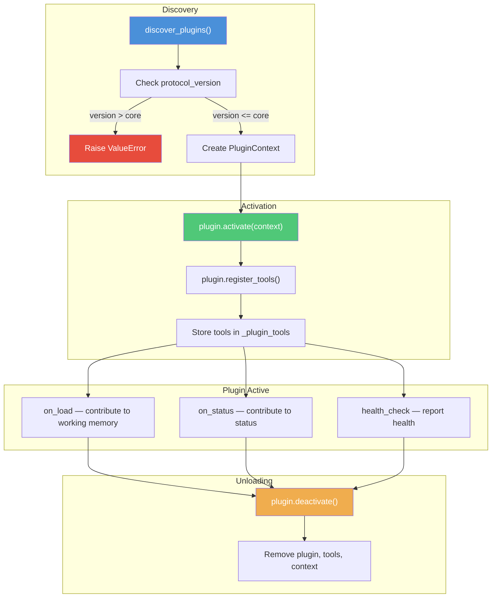
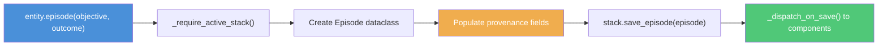

# CoreProtocol — The Coordinator

The core is the bus. It connects stacks, plugins, and the model. It has an ID. It routes operations. It manages the composition.

The core is not "the entity." The entity is the composition. But the core is what holds the composition together.

<Note>
The `core_id` persists across reconfigurations. Swap the model, change the stacks, add or remove plugins -- the `core_id` stays the same.
</Note>

## CoreProtocol Interface

The default implementation is `kernle.entity.Entity`.

### Properties

| Property | Type | Description |
|----------|------|-------------|
| `core_id` | `str` | Persistent identifier for this core |
| `model` | `Optional[ModelProtocol]` | Currently bound model (`None` if not configured) |
| `active_stack` | `Optional[StackProtocol]` | Currently active stack (`None` if none attached) |
| `stacks` | `dict[str, StackInfo]` | All attached stacks, keyed by stack_id |
| `plugins` | `dict[str, PluginInfo]` | All loaded plugins, keyed by name |

### Model Management

| Method | Signature | Description |
|--------|-----------|-------------|
| `set_model` | `(model: ModelProtocol) -> None` | Bind a model. Replaces any previous model. Notifies all stacks via `on_model_changed`. |

### Stack Management

| Method | Signature | Description |
|--------|-----------|-------------|
| `attach_stack` | `(stack, *, alias=None, set_active=True) -> str` | Attach a stack. Returns the stack_id. Raises `ValueError` on duplicate. |
| `detach_stack` | `(stack_id: str) -> None` | Detach a stack. The stack continues to exist independently. |
| `set_active_stack` | `(stack_id: str) -> None` | Switch which attached stack receives routed operations. |

### Plugin Management

| Method | Signature | Description |
|--------|-----------|-------------|
| `load_plugin` | `(plugin: PluginProtocol) -> None` | Activate a plugin. Creates PluginContext, registers tools. |
| `unload_plugin` | `(name: str) -> None` | Deactivate and remove a plugin. |
| `discover_plugins` | `() -> list[PluginInfo]` | Scan entry points for available plugins. |

### Routed Memory Operations

| Method | Key Parameters |
|--------|---------------|
| `episode()` | `objective, outcome, *, lessons, tags, source, context` |
| `belief()` | `statement, *, type, confidence, foundational, source` |
| `value()` | `name, statement, *, priority, type, foundational` |
| `goal()` | `title, *, description, goal_type, priority` |
| `note()` | `content, *, type, speaker, tags, protect, source` |
| `drive()` | `drive_type, *, intensity, focus_areas, decay_hours` |
| `relationship()` | `other_stack_id, *, trust_level, notes, entity_type` |
| `raw()` | `blob, *, source` |

### Routed Search, Load, and Status

| Method | Signature | Description |
|--------|-----------|-------------|
| `search` | `(query, *, limit=10, record_types=None, context=None) -> list[SearchResult]` | Semantic search on active stack |
| `load` | `(*, token_budget=8000, context=None) -> dict[str, Any]` | Assemble working memory, then call `on_load()` on all plugins |
| `status` | `() -> dict[str, Any]` | Full system status including core, model, stacks, and plugins |

### Trust Operations

| Method | Signature |
|--------|-----------|
| `trust_set` | `(entity, domain, score, *, evidence=None) -> str` |
| `trust_get` | `(entity, *, domain=None) -> list[TrustAssessment]` |
| `trust_list` | `(*, domain=None, min_score=None) -> list[TrustAssessment]` |

### Checkpoint & Binding

| Method | Signature | Description |
|--------|-----------|-------------|
| `checkpoint` | `(message="") -> str` | Save composition checkpoint, returns checkpoint_id |
| `from_checkpoint` | `(path: Path) -> CoreProtocol` | Restore from checkpoint file (classmethod) |
| `get_binding` | `() -> Binding` | Snapshot current composition (used internally by checkpoint) |

## Stack Management

The core manages multiple stacks with one active at a time. All routed operations go to the active stack.

```python
from kernle.entity import Entity
from kernle.stack import SQLiteStack

# Create the core
entity = Entity(core_id="my-entity")

# Attach stacks (returns stack_id, alias is cosmetic)
entity.attach_stack(SQLiteStack("primary"), alias="primary")
entity.attach_stack(SQLiteStack("work"), alias="work", set_active=False)

# Switch context (by stack_id)
entity.set_active_stack("work")

# Detach when done (by stack_id)
entity.detach_stack("work")
```

When a stack is attached, the core calls `stack.on_attach(core_id, inference_service)` so the stack can pass the inference service to its components. When detached, `stack.on_detach(core_id)` clears inference access.

## Plugin Lifecycle

Plugins follow a strict lifecycle managed by the core.


```mermaid
graph TD
  subgraph Discovery
    A["discover_plugins()"] --> B["Check protocol_version"]
    B -->|"version > core"| C["Raise ValueError"]
    B -->|"version <= core"| D["Create PluginContext"]
  end

  subgraph Activation
    D --> E["plugin.activate(context)"]
    E --> F["plugin.register_tools()"]
    F --> G["Store tools in _plugin_tools"]
  end

  subgraph Active["Plugin Active"]
    G --> H["on_load — contribute to working memory"]
    G --> I["on_status — contribute to status"]
    G --> J["health_check — report health"]
  end

  subgraph Unloading
    H & I & J --> K["plugin.deactivate()"]
    K --> L["Remove plugin, tools, context"]
  end

  style A fill:#4a90d9,color:#fff
  style E fill:#50c878,color:#fff
  style C fill:#e74c3c,color:#fff
  style K fill:#f0ad4e,color:#fff
```

## Protocol Version Enforcement

The core checks the plugin's `protocol_version` property on load:

```python
# From Entity.load_plugin()
plugin_pv = getattr(plugin, "protocol_version", None)
if plugin_pv is not None and plugin_pv > PROTOCOL_VERSION:
    raise ValueError(
        f"Plugin '{plugin.name}' requires protocol version {plugin_pv}, "
        f"but this core supports version {PROTOCOL_VERSION}."
    )
elif plugin_pv is not None and plugin_pv < PROTOCOL_VERSION:
    logger.warning(
        "Plugin '%s' uses protocol version %d (current: %d).",
        plugin.name, plugin_pv, PROTOCOL_VERSION,
    )
```

This ensures that a plugin built for a newer protocol cannot silently break on an older core. Older plugins are loaded with a warning since the core is expected to maintain backward compatibility.

## Operation Routing

When you call `entity.episode(...)`, the core does not just forward to the stack. It enforces provenance first.


```mermaid
graph LR
  A["entity.episode(objective, outcome)"] --> B["_require_active_stack()"]
  B --> C["Create Episode dataclass"]
  C --> D["Populate provenance fields"]
  D --> E["stack.save_episode(episode)"]
  E --> F["_dispatch_on_save() to components"]

  style A fill:#4a90d9,color:#fff
  style D fill:#f0ad4e,color:#fff
  style F fill:#50c878,color:#fff
```

The provenance step populates:

- **id**: New UUID
- **stack_id**: From the active stack
- **source_entity**: `"core:{core_id}"` or a custom source (plugins use `"plugin:{name}"`)
- **source_type**: `"direct_experience"`
- **created_at**: Current UTC timestamp
- **derived_from**: Optional lineage chain
- **context / context_tags**: Optional grouping

This is why writing through the core matters. Direct `stack.save_*()` calls skip provenance, producing memories with incomplete attribution.

```python
# The proper way -- full provenance
entity.episode(
    "Deploy to production",
    "Successful with zero downtime",
    lessons=["Blue-green deploys work well"],
    tags=["deployment"],
    context="work",
)

# Bypass -- incomplete provenance (for migration/repair only)
stack.save_episode(Episode(
    id="...",
    stack_id=stack.stack_id,
    objective="Deploy to production",
    outcome="Successful",
    # No source_entity, no context, no source_type
))
```

## Checkpoint Save and Restore

The `checkpoint()` method saves the current composition to a timestamped JSON file. `from_checkpoint()` restores an Entity from a saved checkpoint.

```python
# Save current composition
cp_id = entity.checkpoint("before refactor")
# Saves to ~/.kernle/checkpoints/{core_id}_{timestamp}_{uuid}.json

# Restore later
from pathlib import Path
restored = Entity.from_checkpoint(Path.home() / ".kernle/checkpoints/my-entity_20260216_...json")
```

Checkpoint files include:
- `schema_version` -- format version (currently `1`) for forward compatibility
- `checkpoint_id` -- unique identifier for this checkpoint
- `message` -- human-readable description
- `binding` -- the composition snapshot (core_id, model_config, stacks, plugins)
- `created_at` -- UTC timestamp

**Schema versioning policy:**
- Missing `schema_version` is treated as version 1 with a warning (backward compat for checkpoints created before this change)
- `schema_version > 1` raises `ValueError` (forward compat -- prevents loading newer formats with older code)

**Restore semantics:** Restore is best-effort. Individual stack, plugin, or model failures during rehydration are logged at WARNING level but do not abort the restore. A partially restored entity is better than no entity in alpha.

**Retention:** Each `checkpoint()` call retains the 10 most recent checkpoints per `core_id`, removing older ones automatically.
